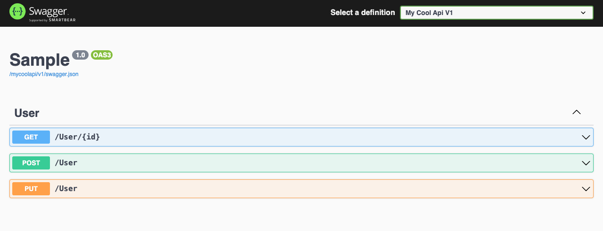

# SwaggerUIAuthorization

 

## Usage

Call `AddSwaggerUIAuthorization` to register depedencies.

    builder.Services.AddSwaggerUIAuthorization();

Register SwaggerUI through `UseSwaggerUIAuthorization` instead of Swashbuckle's `UseSwaggerUI` extension method. This is a wrapper around `UseSwaggerUI` that will handle authentication against the specified scheme. The swagger document will be conditionally rendered based on authorization rules defined in an `AuthorizeAttribute`.

    app.UseSwagger(options =>
    {
        options.RouteTemplate = "mycoolapi/{documentname}/swagger.json";
    });

    app.UseSwaggerUIAuthorization("MyAuthenticationScheme", options => 
    {
        options.SwaggerEndpoint("/mycoolapi/v1/swagger.json", "My Cool Api V1");
        options.RoutePrefix = "mycoolapi";
    });

    // ReDoc can be registered as well
    app.UseReDoc(options => 
    {
        options.SpecUrl = "/mycoolapi/v1/swagger.json";
        options.RoutePrefix = "mycoolapi/docs";
    });

## Example

The `UserController` will only be rendered for authenticated users with the role "User" as specified by the `AuthorizeAttribute`. The "Delete" action will only be rendered for authenticated users who have the "User" role and satisfy all of the requirements for the "CanDeletePolicy".

    [ApiController]
    [Route("[controller]")]
    [Authorize(Roles = "User")]
    public class UserController : ControllerBase
    {
        [HttpGet]
        [Route("{id}")]
        public IActionResult Get(Guid id) => Ok();

        [HttpPost]
        public IActionResult Post([FromBody] User request) => Ok();

        [HttpPut]
        public IActionResult Put([FromBody] User request) => Ok();

        [HttpDelete]
        [Route("{id}")]
        [Authorize("CanDeletePolicy")]
        public IActionResult Delete(Guid id) => Ok();
    }

In the case below, the authenticated user has the "User" role claim only.

### The same rules that .NET has defined for an AuthorizeAttribute applies
- Comma separated roles are evaluated on an OR basis
- Multiple `AuthorizeAttribute`'s are evaluated on an AND basis
- An `AllowAnonymousAttribute` bypasses all authorization

However, if an endpoint is protected by an authentication scheme different
from the one specified in the `UseSwaggerUIAuthorization` builder, then a challenge
is NOT requested - the endpoint will not be rendered.